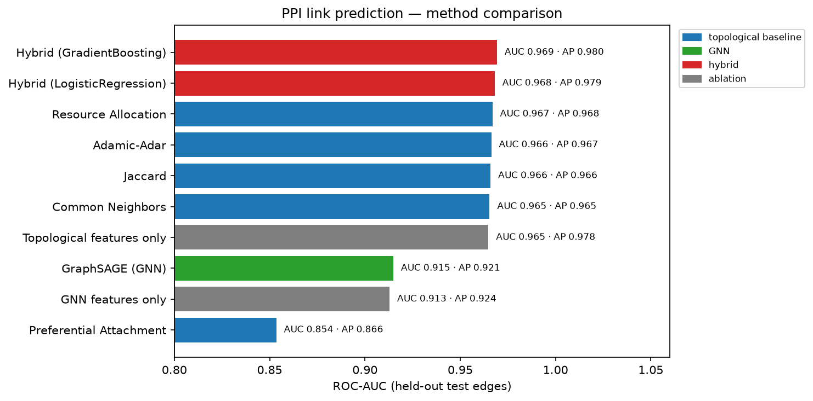
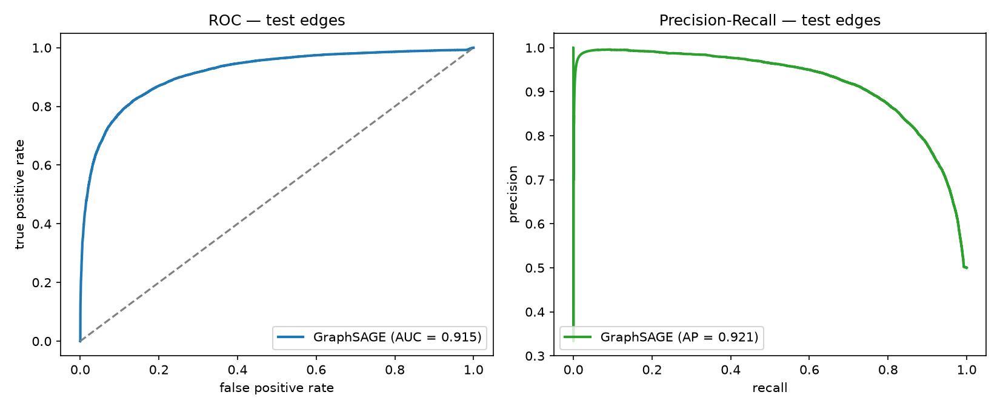
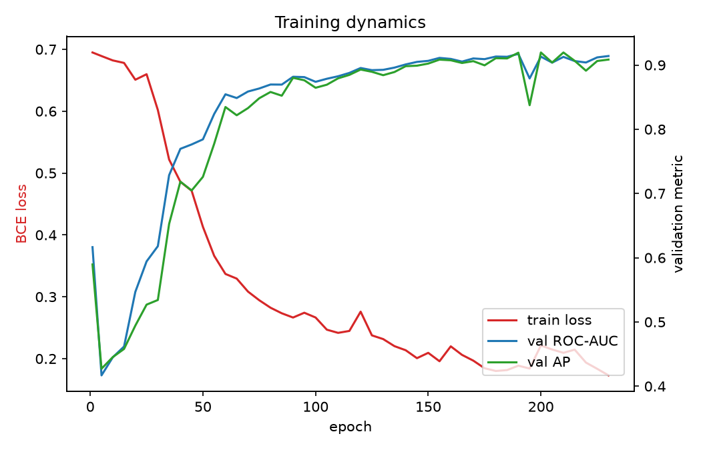

# PPI-GNN: Protein–Protein Interaction Prediction with a Graph Neural Network

Predicting physical and functional **protein–protein interactions (PPIs)** in the
human interactome by framing it as a **link-prediction** problem on the STRING
network and solving it with an inductive **GraphSAGE** graph neural network.

The project deliberately includes strong classical baselines and an ablation
study, because on a database like STRING the interesting question is not "can a
GNN score well" (it can) but **"does a GNN learn anything that decades-old
topological heuristics don't already capture?"** — and here, it does: the GNN
embedding is the single most informative learned feature after Resource
Allocation, and a hybrid model using both beats every pure-topology method.



---

## TL;DR results

| Model | ROC-AUC | Avg. Precision |
|---|---|---|
| Preferential Attachment | 0.854 | 0.866 |
| **GraphSAGE (GNN, embeddings only)** | **0.915** | **0.921** |
| Common Neighbors | 0.965 | 0.965 |
| Jaccard | 0.966 | 0.966 |
| Adamic–Adar | 0.966 | 0.967 |
| Resource Allocation | 0.967 | 0.968 |
| **Hybrid: GNN + topology → Logistic Regression** | **0.968** | **0.979** |
| **Hybrid: GNN + topology → Gradient Boosting** | **0.969** | **0.980** |

Evaluated on **23,671 held-out positive edges + 23,671 sampled negatives**, on a
split the message-passing graph never sees.

---

## The data

[STRING v12.0](https://string-db.org/), *Homo sapiens* (taxon 9606), the
`protein.links` file.

| Step | Result |
|---|---|
| Raw scored protein pairs | 13,715,404 |
| Kept at `combined_score ≥ 700` (high confidence) | 473,860 (directed) |
| Undirected simple graph | 16,201 nodes / 236,930 edges |
| Largest connected component (used) | **15,882 proteins / 236,712 interactions** |
| Mean degree | ≈ 29.8 |

STRING edges are not purely experimental — the combined score aggregates
co-expression, conserved genomic neighbourhood, text-mining, databases and
experiments. That is exactly why topological baselines are so strong here, and
why "beat the baseline" is a meaningful bar.

### Node features (no free per-node embedding)

The encoder is **fully inductive**: there is no learnable lookup table indexed by
protein id, so the model cannot simply memorise the training graph. Each node
carries:

- **6 structural descriptors** — log-degree, clustering coefficient, log k-core
  number, log average-neighbour-degree, log triangle count, log-scaled PageRank
- **32 Laplacian positional-encoding dimensions** — the 2nd–33rd eigenvectors of
  the symmetric normalised graph Laplacian, giving each protein a global
  "coordinate" in the network. Eigenvector signs are randomly flipped every
  epoch as data augmentation.

---

## Method

### 1. Splitting (`03_make_splits.py`)
Positive edges are split 85 / 5 / 10 into train / val / test. For every positive
edge one **negative** (non-edge) pair is sampled, disjoint from all real edges,
so all three splits are balanced. **Message passing at train time uses only the
training positives** — val/test edges are never in the graph the GNN sees.

### 2. Topological baselines (`04_baselines.py`)
Common Neighbors, Jaccard, Adamic–Adar, Resource Allocation and Preferential
Attachment, each computed on the training graph only and scored on the test
edges. These are the bar to beat.

### 3. The GNN (`model.py`, `05_train_gnn.py`)
```
node features ──► MLP ──► 3× SAGEConv (mean aggregator, LayerNorm, ReLU, dropout)
                   │                                              │
                   └────────────────── skip connection ──────────►(+)──► z  (128-d)

score(i, j) = MLP( [ z_i ⊙ z_j , (z_i − z_j)² ] )     # symmetric pair readout
```
- Loss: binary cross-entropy with **fresh random negatives resampled every
  epoch**
- Adam (lr 3e-3), gradient clipping, early stopping on validation ROC-AUC
- ~264 s / 230 epochs on an Apple M-series GPU (MPS), 67k parameters

### 4. Hybrid model + ablation (`07_hybrid_model.py`)
Per candidate pair we build 13 features — 7 topological (CN, AA, RA, Jaccard,
log-pref-attachment, log-min/max-degree) and 6 from the frozen GNN embeddings
(cosine, dot, L2 distance, Hadamard mean/max/min) — and train a Gradient Boosting
classifier and a Logistic Regression on the training split.

### 5. Novel-interaction ranking (`08_predict_novel.py`)
The trained hybrid model scores all ~319k non-edges among the 800 highest-degree
proteins and reports the most confident predictions as hypotheses.

---

## Key findings

**1. A pure GNN does *not* beat classical heuristics on STRING.**
GraphSAGE reaches ROC-AUC 0.915 / AP 0.921 — clearly better than Preferential
Attachment (0.854) but a few points *below* Common Neighbors / Adamic–Adar /
Resource Allocation (≈ 0.966). On a network whose edges are already partly
defined by co-occurrence statistics, "how many neighbours do these two proteins
share" is a very hard feature to beat.



**2. The GNN still learns something complementary.**
In the hybrid Logistic Regression, standardised coefficients rank
**`gnn_cosine` second (7.70)**, behind only Resource Allocation (13.74) and ahead
of Jaccard (3.58) and Adamic–Adar (1.63). The GNN embedding encodes
interaction-relevant signal that the pairwise heuristics miss.

**3. Combining both is best.**
| Feature set → Gradient Boosting | ROC-AUC | AP |
|---|---|---|
| GNN embedding features only | 0.913 | 0.924 |
| Topological features only | 0.965 | 0.978 |
| **Both (hybrid)** | **0.969** | **0.980** |

The hybrid improves average precision over the best single baseline by ~1.2
points — the regime that matters when you screen millions of candidate pairs and
only the top of the ranking gets tested.



**4. Top-ranked novel predictions are biologically coherent.**
The highest-confidence hybrid predictions among hub proteins that STRING v12.0
does *not* link at high confidence include:

| Pair | Interpretation |
|---|---|
| `HBA2` – `HBZ` | haemoglobin α- and ζ-globin subunits |
| `WNT16` – `WNT6`, `WNT16` – `WNT9A` | Wnt ligand paralogues |
| `RSL24D1` – `RPS12` / `NHP2` / `RRP9` / `NOL6` | ribosome-biogenesis / rRNA-processing module |
| `SPCS1` / `SEC61A1` / `MRNIP` | ER protein-translocation machinery |
| `OSM` / `IL4` / `IL5` / `IL23A` | secreted immune cytokines |
| `CDH9` – `CDH3` | cadherin cell-adhesion paralogues |

These are exactly the kind of same-complex / same-family pairs one would expect a
network model to recover. Full list: [`results/top_novel_predictions.csv`](results/top_novel_predictions.csv).
*(These are computational hypotheses, not experimentally validated interactions.)*

---

## Repository structure

```
ppi-gnn/
├── environment / requirements.txt
├── run_all.sh                     # full pipeline, in order
├── src/
│   ├── config.py                  # paths, thresholds, hyper-parameters
│   ├── 01_download_data.py        # fetch STRING v12.0 (human)
│   ├── 02_build_graph.py          # filter → LCC → structural + Laplacian-PE features
│   ├── 03_make_splits.py          # fixed balanced train/val/test edge split
│   ├── 04_baselines.py            # topological link-prediction baselines
│   ├── model.py                   # GraphSAGE encoder + MLP pair decoder
│   ├── 05_train_gnn.py            # training loop, early stopping, curves
│   ├── 06_compare_results.py      # merge baseline + GNN + hybrid metrics into one figure
│   ├── pair_features.py           # shared feature construction for a protein pair
│   ├── 07_hybrid_model.py         # GNN + topology → GB / LogReg, ablation
│   └── 08_predict_novel.py        # rank unrecorded interactions with the hybrid model
├── data/                          # STRING downloads + processed graph (not tracked)
└── results/                       # metrics (JSON/CSV) and figures
```

## How to run

```bash
python -m venv .venv && source .venv/bin/activate
pip install -r requirements.txt

./run_all.sh
# or step by step:
python src/01_download_data.py
python src/02_build_graph.py
python src/03_make_splits.py
python src/04_baselines.py
python src/05_train_gnn.py
python src/06_compare_results.py
python src/07_hybrid_model.py
python src/08_predict_novel.py
```

Everything is seeded (`SEED = 42` in `config.py`). Runtime end-to-end is a few
minutes on a laptop; the GNN uses CUDA or Apple MPS automatically if present.

## Tech stack

**PyTorch · PyTorch Geometric** (SAGEConv) · **NetworkX** (graph construction,
topological predictors) · **scikit-learn** (baselines, hybrid classifiers,
metrics) · **SciPy** (Laplacian eigendecomposition) · **NumPy / pandas /
matplotlib**.
**Data:** STRING v12.0, *Homo sapiens*.

## What this project shows

- Framing a biological database as a graph ML problem (link prediction) with a
  leakage-free evaluation protocol
- Building an **inductive** GNN (positional + structural features, no node-id
  memorisation) rather than a transductive one
- Benchmarking honestly against strong classical baselines instead of only
  reporting a single headline number
- Using ablation and feature-importance to show *what* the GNN contributes
- Turning a trained model into a ranked list of testable biological hypotheses

## Author

**Ariss Alimi** — M.Sc. Bioinformatics, Université de Montréal
[GitHub](https://github.com/aral16)
